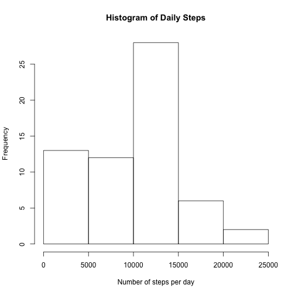
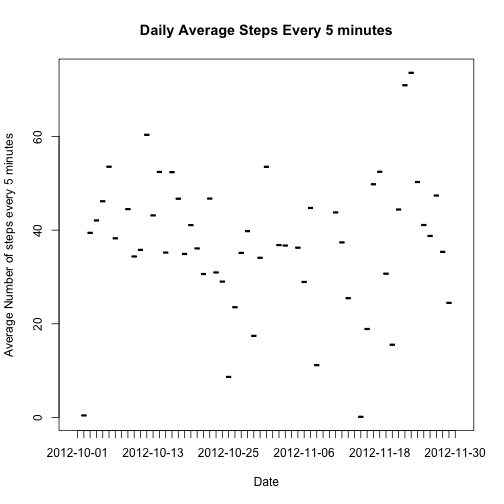
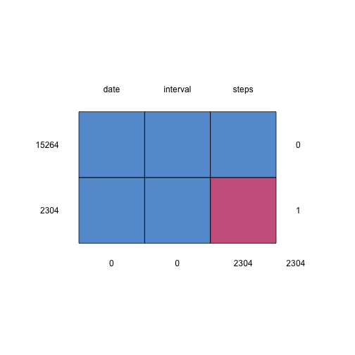

First, load the necessary libraries


```r
library(dplyr)
library(mice)
library(timeDate)
library(ggplot2)
```

##1. Code for reading in the dataset and/or processing the data

downlaod the data files

```r
file_url <- "https://d396qusza40orc.cloudfront.net/repdata%2Fdata%2Factivity.zip"
download.file(url=file_url, "./activity.zip")
```


Unzip the CSV file

```r
unzip("./activity.zip")
```

and finally read the CSV file

```r
activity <- read.csv("./activity.csv")
```


##2. Histogram of the total number of steps taken each day
Calculate the total daily steps 

```r
sum_daily_steps <- activity %>%
  group_by(date) %>%
  summarize(number_of_steps = sum(steps, na.rm = TRUE))
```

plot the histogram of the total daily tem

```r
hist(sum_daily_steps$number_of_steps, xlab = "Number of steps per day" ,main = "Histogram of Daily Steps")
```




##3. Mean and median number of steps taken each day
Calculate the mean daily steps

```r
mean_daily_steps <- activity %>%
  group_by(date) %>%
  summarize(number_of_steps = mean(steps, na.rm = TRUE))
```

print the results

```r
mean_daily_steps
```

```
## # A tibble: 61 x 2
##    date       number_of_steps
##    <fct>                <dbl>
##  1 2012-10-01         NaN    
##  2 2012-10-02           0.438
##  3 2012-10-03          39.4  
##  4 2012-10-04          42.1  
##  5 2012-10-05          46.2  
##  6 2012-10-06          53.5  
##  7 2012-10-07          38.2  
##  8 2012-10-08         NaN    
##  9 2012-10-09          44.5  
## 10 2012-10-10          34.4  
## # ... with 51 more rows
```

Calculate the median daily steps

```r
median_daily_steps <- activity %>%
  group_by(date) %>%
  summarize(number_of_steps = median(steps, na.rm = TRUE))
```
print the results

```r
median_daily_steps
```

```
## # A tibble: 61 x 2
##    date       number_of_steps
##    <fct>                <dbl>
##  1 2012-10-01              NA
##  2 2012-10-02               0
##  3 2012-10-03               0
##  4 2012-10-04               0
##  5 2012-10-05               0
##  6 2012-10-06               0
##  7 2012-10-07               0
##  8 2012-10-08              NA
##  9 2012-10-09               0
## 10 2012-10-10               0
## # ... with 51 more rows
```

##4. Time series plot of the average number of steps taken
plot the average number of steps

```r
plot(mean_daily_steps$number_of_steps ~ mean_daily_steps$date,type="l", xlab="Date", ylab = "Average Number of steps every 5 minutes", main = "Daily Average Steps Every 5 minutes")
```



##5. The 5-minute interval that, on average, contains the maximum number of steps
Find the most active interval

```r
most_active_interval <- activity %>%
  group_by(interval) %>%
  summarize(number_of_steps = mean(steps, na.rm = TRUE)) %>%
  filter(number_of_steps == max(number_of_steps))
```
print the results

```r
most_active_interval
```

```
## # A tibble: 1 x 2
##   interval number_of_steps
##      <int>           <dbl>
## 1      835            206.
```

##6. Code to describe and show a strategy for imputing missing data
show the statistic for missing data

```r
md.pattern(activity)
```



```
##       date interval steps     
## 15264    1        1     1    0
## 2304     1        1     0    1
##          0        0  2304 2304
```
This shows that 2304 observation has missing steps

impute the missing data

```r
imputedActivity <- mice(activity,m=5,maxit=50,meth='pmm',seed=500)
```

```
## Error in data.frame(it = s$it, im = s$im, dep = s$dep, meth = if (is.null(meth)) s$meth else meth, : arguments imply differing number of rows: 0, 1
```

Add the missing data to the origianl data set

```r
completedActivity <- complete(imputedActivity,1)
```

```
## Error in is.mids(data): object 'imputedActivity' not found
```

##7. Histogram of the total number of steps taken each day after missing values are imputed
Calculte the sum of steps with the missing data imputed

```r
sum_complete_daily_steps <- completedActivity %>%
  group_by(date) %>%
  summarize(number_of_steps = sum(steps, na.rm = TRUE))
```

```
## Error in eval(lhs, parent, parent): object 'completedActivity' not found
```
plot the histogram of the results

```r
hist(sum_complete_daily_steps$number_of_steps, xlab = "Number of steps per day" ,main = "Histogram of Daily Steps (missing data imputed)")
```

```
## Error in hist(sum_complete_daily_steps$number_of_steps, xlab = "Number of steps per day", : object 'sum_complete_daily_steps' not found
```

To further analyze the effect of filling the missing values, the mean and median daily steps are calculated as well:
Calculate the mean daily steps for the data after filling the missing values

```r
mean_complete_daily_steps <- completedActivity %>%
  group_by(date) %>%
  summarize(number_of_steps = mean(steps, na.rm = TRUE))
```

```
## Error in eval(lhs, parent, parent): object 'completedActivity' not found
```

print the results

```r
mean_complete_daily_steps
```

```
## Error in eval(expr, envir, enclos): object 'mean_complete_daily_steps' not found
```

Calculate the median daily steps

```r
median_complete_daily_steps <- completedActivity %>%
  group_by(date) %>%
  summarize(number_of_steps = median(steps, na.rm = TRUE))
```

```
## Error in eval(lhs, parent, parent): object 'completedActivity' not found
```
print the results

```r
median_complete_daily_steps
```

```
## Error in eval(expr, envir, enclos): object 'median_complete_daily_steps' not found
```


##8. Panel plot comparing the average number of steps taken per 5-minute interval across weekdays and weekends
find the average number of steps per 5 minutes interval for weekdays and weekends

```r
average_steps_by_interval <- completedActivity %>%
  mutate(isWeekday = ifelse(isWeekday(date, wday=1:5),'Weekdays','Weekends'))  %>%
  group_by(interval,isWeekday) %>%
  summarize(number_of_steps = mean(steps, na.rm = TRUE))
```

```
## Error in eval(lhs, parent, parent): object 'completedActivity' not found
```

Use the data to create a panel plot comparing activity in weekdays and weekends

```r
ggplot(data=average_steps_by_interval)+geom_line(aes(x=interval, y=number_of_steps))+facet_grid(isWeekday~.)
```

```
## Error in ggplot(data = average_steps_by_interval): object 'average_steps_by_interval' not found
```
